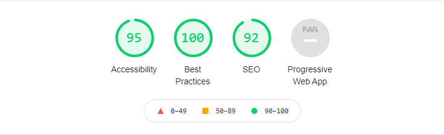

## General info
This project is Task  Trufla Code Challenge , The design is very cool and has small tricks
## Challenge
* Header in Desktop is different from Mobile and tablet , 
  I use the Media Query for each screen to implement the Design 
* Menu in Desktop is big different from Mobile and tablet ,
  I use the Js and Media Query to make the Menu More Dynamic and Animation
* DropDwon in Menu Mobile , i ues the Js and Animation
* Section Product has the different desgin in each screen
	
## Bonus
* Include any build scripts used in the task, ues Js to made the Derpdwon and Menu
* Provide documentation of cross-browser testing.
* Add SEO and Lighthouse optimizations, Ues meta tags and the syntax 

## Demo Link
* https://abanoub2017.github.io/Trufla_Code_Challenge/index.html